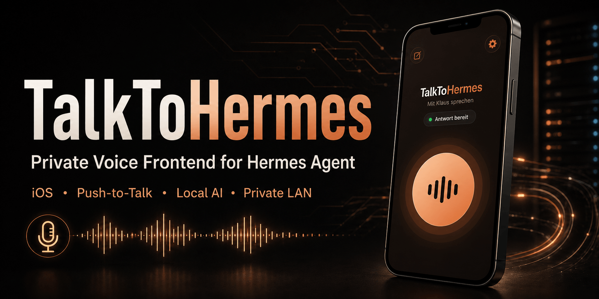

# TalkToHermes



## What is TalkToHermes?

TalkToHermes is a private, native iPhone and iPad voice client for speaking naturally with your own Hermes Agent and following the full conversation on screen. It combines secure per-user bridge isolation with configurable speech recognition and voice synthesis fallbacks, live approval and cancellation flows, and Keychain-backed credentials. The interface is available in English and German, with the app language and spoken language selected independently.

The central architectural decision is **local operation for maximum privacy**. Speech recognition, multiple speech synthesis paths, and all voice orchestration and control can run entirely on systems you operate within your private network. Voice providers can be arranged in configurable quality and fallback tiers. If a preferred service is unavailable, TalkToHermes automatically continues with the next configured provider and ultimately with local last-resort STT or TTS. Speech recordings and transcripts therefore do not need to leave your own infrastructure. For fully local end-to-end operation, Hermes must also use a locally hosted LLM provider, for example a model served through Ollama.

TalkToHermes is not a standalone all-in-one package. In addition to the iOS app, it requires an installed and configured Hermes Agent, the TalkToHermes Voice Bridge, and a private HTTPS endpoint. The additional voice components depend on the selected provider chain:

- **Speech recognition:** Faster-Whisper on a suitable GPU system as a high-quality primary STT tier; optionally Wyoming-Faster-Whisper as a private network service, plus MLX-Whisper on an Apple Silicon Mac or another local Hermes STT model as a fallback.
- **Speech synthesis:** local Piper as the last-resort TTS provider; optionally a persistent Wyoming-Piper service—for example on a Mac—for lower latency and additional quality tiers.
- **Cloned voices:** optional OmniVoice with a suitable accelerator/PyTorch environment and private reference recordings.
- **Fully local language model:** a local Hermes model provider such as Ollama when LLM processing must also remain within your own infrastructure.

## Architecture

```text
iPhone/iPad
  -> hermes-agent.home.arpa:<per-instance HTTPS port>
  -> narrow per-instance TalkToHermes Voice Bridge
  -> official Hermes sessions/runs API on loopback
  -> ordered voice providers through bounded adapters
```

Each user has a separate process, token, port, Hermes home, database, audio store, and session mapping. The app selects a configured bridge endpoint but cannot ask that bridge to switch profile or instance.

## Provider policy

```text
STT: ordered per-instance providers (OpenAI-compatible -> optional Wyoming -> local)
TTS: ordered per-instance providers (OmniVoice -> optional Wyoming-Piper -> local Piper)
```

List order is fallback order. Omit an optional middle provider to fall straight through to the configured local last resort. Only local STT/Piper is marked as locally degraded. OmniVoice listens on a configured RFC 1918 IPv4 address and the fixed dedicated port `9090`; wildcard, loopback, public or invalid addresses and every other port are rejected at configuration load and listener preflight.

## Status

The bridge and native voice path implement bounded private upload, STT fallback, official Hermes run/SSE/approval/cancel, whole-answer quality-orchestrated TTS, authenticated audio delivery, restart recovery, and bounded retention. Dedicated STT (`9444`) and OmniVoice (`9443`) examples use authenticated TLS on `primary-voice-server.home.arpa`. The SwiftUI client provides Keychain-backed authentication, transactional settings, replay/stop and tap-to-interrupt recording. The authenticated bridge status supplies the configured instance ID and assistant display name to the client. A bounded operator-configurable voice overlay preserves the selected Hermes identity and safety prompt, while the client can select only `short`, `normal`, or `detailed`.

## Canonical documents

- [Architecture](docs/architecture.md)
- [Security baseline](docs/security.md)
- [iOS client setup and endpoint configuration](ios/README.md)
- [Production deployment and operations](deployment/README.md)
- [API contract](api/openapi.yaml)
- [OmniVoice service](services/omnivoice/README.md)
- [STT service](services/stt/README.md)
- [Voice reuse and provenance](docs/upstream-voice-reuse.md)
- [License](LICENSE)
